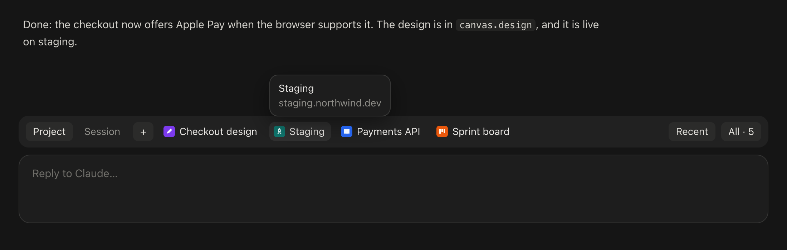
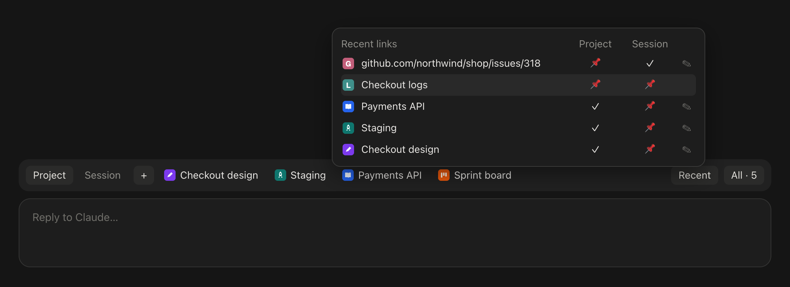
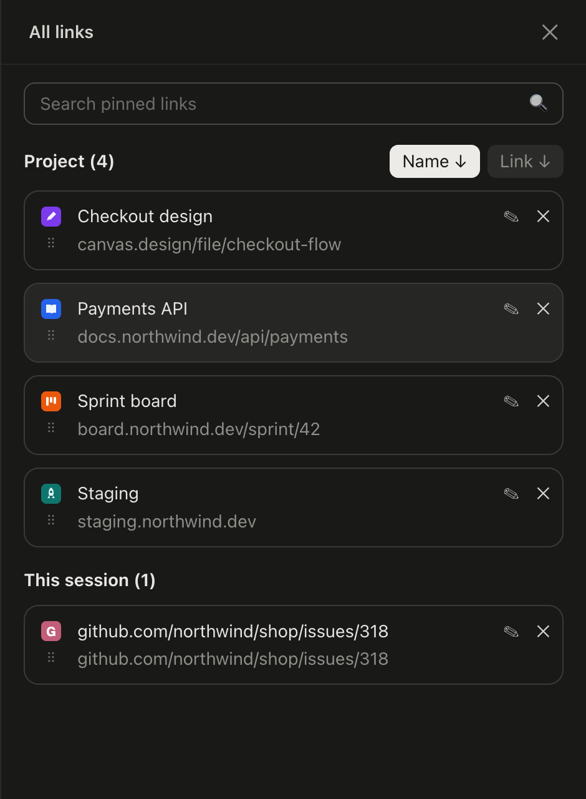
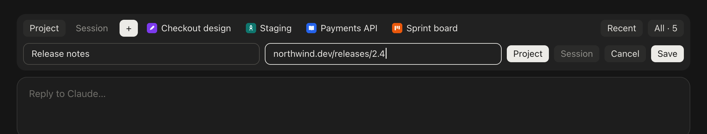

# Claude Links — a links bar for Claude Desktop

**English** · [Русский](docs/README.ru.md)



A mod for the **Code tab of Claude Desktop** (macOS) that keeps the links you work with one click away, in a bar above the prompt:

- **Pinned links with favicons**, up to 4 on the bar. Pin a link to the **project** (every session in that folder sees it) or to **this session** only; the small **Project / Session** switch on the left picks which set the bar shows.
- **Favicons and titles found for you**: the icon is read from the page itself (the icons it declares, then `/favicon.ico`), and a link pinned without a name takes its page's title. A link with no name shows as its URL without `https://` and `www.`.
- **The links share the bar**: one link takes all the free room, four a quarter each; a cut name shows in full, with its URL, when you hover it.
- **+** opens one row: name, link, Project / Session, Cancel, Save.
- **Recent**: hover it for the session's 10 latest links, from what you and Claude wrote and the pages Claude opened. Pin any of them to the project or the session, unpin, rename.
- **All** opens a side pane with every pinned link: search, sort by name or by link, drag to reorder (the first 4 of each list are on the bar), rename, unpin.
- **Speaks your language**: English, Deutsch, Français, Italiano, Español, Українська, Русский, following Claude Desktop's own language setting; English for every other language.

It is built on Claude Code's **mods** (plugins of function hooks), so it does not patch the Claude app: updates of Claude don't break it, and removing the plugin removes it. It shares the band above the prompt with other mods, such as [Claude Tabs](https://github.com/tripolskiydigital/claude-tabs): the links row sits under what they draw.

<p>
  
  
</p>



<sub>Demo links. The favicons, the letter drawn for a site without one and the words come from the mod's own code; [docs/demo/render.ts](docs/demo/render.ts) renders these pictures.</sub>

## Requirements

- **macOS** and **Claude Desktop** with mods support (Claude Code engine 2.1.289 or later).
- `curl` (part of macOS) for favicons and titles.
- The mod draws in Claude Desktop's Code tab. It also loads in the terminal `claude`, where it draws a simpler text version.

## Install

### From the marketplace (recommended)

```bash
claude plugin marketplace add tripolskiydigital/claude-links
```

```bash
claude plugin install links-bar@claude-links
```

Then open a new session in Claude Desktop (or quit Claude with ⌘Q and open it again for sessions that were already open). To update later:

```bash
claude plugin update links-bar@claude-links
```

### From a clone

```bash
git clone https://github.com/tripolskiydigital/claude-links.git ~/claude-links
```

Then add the folder to `env` in `~/.claude/settings.json` (several folders are separated with `:`):

```json
{
  "env": {
    "CLAUDE_CODE_PLUGIN_DIRS": "/Users/you/claude-links"
  }
}
```

Use one way or the other, not both: with both, the mod loads twice.

## Using it

1. Press **+**, type a name (or leave it empty: the page's title is used) and a link, choose **Project** or **Session**, and **Save**. Or hover **Recent** and press 📌 in the Project or Session column of a link the session already mentioned.
2. Click a link on the bar to open it in your default browser. **Project / Session** switches which pinned links the bar shows.
3. **All** opens the side pane: type in the search field to filter, press **Name** or **Link** to sort (↓ A→Z; press again for ↑ Z→A), drag the ⠿ handle to reorder, ✎ to rename, ✕ to unpin.

The fields are the mod's own: click one to type, Enter saves, and ⌘A, ⌘C, ⌘X, ⌘V and ⌘⌫ work in them.

## How it works

| What | Where it comes from |
| --- | --- |
| Recent links | the current session's transcript: what you and Claude wrote, and the links tools were called with (WebFetch, a browser's navigate); tool output is not scanned |
| Pinned links, the chosen sort, the switch position | the plugin's own store (Claude Code keeps it), keyed by project folder or session id |
| Favicons and titles | the link's page, fetched with `curl`: its `<title>` and `<link rel="icon">`s; then `/favicon.ico`; then, for a public host, Google's favicon service. Favicons are kept in the plugin's store |
| Interface language | the `locale` field of `~/Library/Application Support/Claude/config.json`, picked out by `grep`: the mod never reads the file itself, which also holds account data |
| Opening a link | `open <url>`, your default browser |

Pinned links are read again from the store every 5 seconds, so a project's links pinned in one session show up in its other sessions.

## What the mod reads, writes and runs

**What the mod sends, and where.** To find a favicon and a title the mod fetches **the page of a link you pinned or that the session mentioned**, the icons that page names, and the site's `/favicon.ico`. When a public site has no icon it can read, it asks **Google's favicon service** with the site's host name (`https://www.google.com/s2/favicons?domain=<host>`); local and private hosts (localhost, `.local`, `.test`, private IP ranges) are never sent there. Nothing else leaves your Mac.

**Reads**

- The current session's transcript, through the mod API (`$.session.messages`).
- The `locale` field of Claude Desktop's settings, through `grep` (see the table above).
- The clipboard, with `pbpaste`, only when you press ⌘V in one of the mod's fields.
- The environment variables `HOME`, `TMPDIR` and `LANG`.

**Writes** no file of its own outside the temp folder: pinned links, sorts, the switch position and favicons (data URIs of at most 24 KB) go to the plugin store that Claude Code keeps for every plugin. `curl` writes the pages and pictures it fetches to `$TMPDIR/links-bar-*`. ⌘C and ⌘X write the clipboard through the app (`$.ui.copy`).

**Runs**, each by name; the arguments shown in angle brackets are worked out at the call:

| Program | When | Why |
| --- | --- | --- |
| `open <url>` | you click a link | opens it in your default browser |
| `curl -sL --max-time 8 … -o $TMPDIR/links-bar-page-… <url>` | a link is pinned or mentioned and its site has no favicon in the store yet; a link is pinned without a name | reads the page's title and the icons it declares |
| `curl -sL --max-time 6 --max-filesize 24000 … <icon>` | after that | downloads the favicon |
| `pbpaste` | you press ⌘V in one of the mod's fields | reads the clipboard (asked for in UTF-8) |
| `grep -o -m 1 "locale"… <home>/Library/Application Support/Claude/config.json` | at session start | picks out the interface language without the mod reading the file |

**Hooks**

- `session.start`: reads the pins, the language and the session's recent links, and starts the 5-second refresh of the pins.
- `prompt.submit` and `turn.complete`: read the session's links again. Neither changes the prompt or the turn.
- `ui.render` for the band above the prompt and for the mod's own pane; `ui.message`, `ui.focus` and `ui.close` for the mod's own fields, drag handles and pane.

The mod adds no commands, tools or agents for Claude, and changes nothing Claude reads.

## Limits

- Mods can't style the app's own fields, links or buttons, so the mod draws its own text fields and drag handles: the cursor stays at the end of the text, and part of a text can't be selected with the mouse.
- The look follows Claude Desktop's current UI; a large redesign of the app may need an update of the mod.
- A page behind a login or a bot check gives no title and may give no icon: the bar shows the link's address and the site's first letter instead.

## Uninstall

```bash
claude plugin uninstall links-bar@claude-links
```

Pinned links and favicons go with the plugin's store. The pages and pictures `curl` fetched are in `$TMPDIR/links-bar-*`, which macOS clears by itself.

## Development

```bash
claude plugin validate .
```

```bash
claude plugin test .
```

The module is `hooks/register.tsx`, helpers are in `hooks/lib.ts`, translations in `hooks/i18n.ts`, the state contract in `types/index.d.ts`; the mod's own text field and drag handle are `hooks/text-field.tsx` and `hooks/drag-handle.tsx`. The types of the mod API are written by Claude Code into `.claude-plugin/types/` when it loads the plugin. The README's pictures and the plugin's icon are rendered by `node docs/demo/render.ts` (Node 23.6+ and Google Chrome). To iterate with hot reload, ask Claude in a Code session to work on the mod with the `plugin-authoring` skill, pointing the session's mods folder at your clone.

Issues and pull requests are welcome.

## License

[Apache 2.0](LICENSE)
