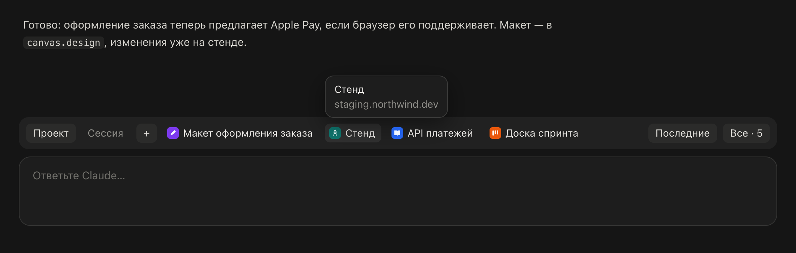
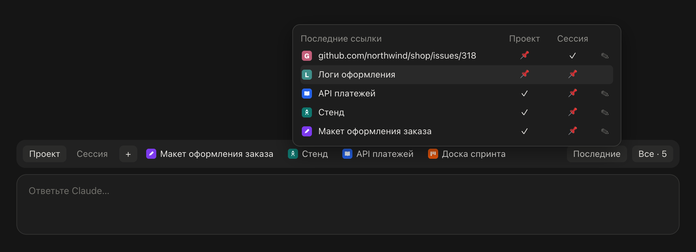
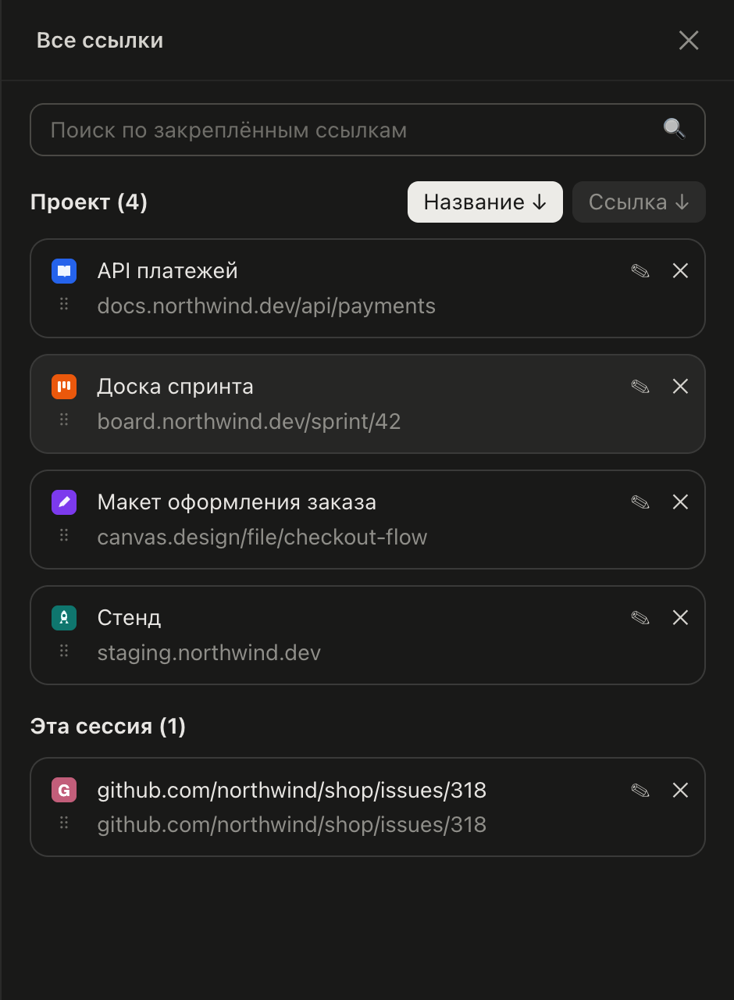
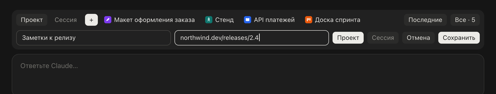

# Claude Links — полоса ссылок для Claude Desktop

[English](../README.md) · **Русский**



Мод для **вкладки Code в Claude Desktop** (macOS): ссылки, с которыми ты работаешь, — в один клик, в полосе над полем ввода.

- **Закреплённые ссылки с favicon**, до 4 на полосе. Ссылку можно закрепить за **проектом** (её видят все сессии этой папки) или только за **этой сессией**; маленький переключатель **Проект / Сессия** слева выбирает, какой набор показывать.
- **Иконки и названия подтягиваются сами**: иконка берётся со страницы (объявленные в ней иконки, затем `/favicon.ico`), а ссылка без названия получает заголовок своей страницы. Ссылка без названия показывается как адрес без `https://` и `www.`.
- **Ссылки делят полосу**: одна занимает всё свободное место, четыре — по четверти; обрезанное название при наведении видно целиком, вместе с адресом.
- **+** открывает одну строку: название, ссылка, Проект / Сессия, Отмена, Сохранить.
- **Последние** — при наведении 10 последних ссылок сессии: из того, что писали ты и Claude, и из страниц, которые Claude открывал. Любую можно закрепить в проекте или сессии, открепить, переименовать.
- **Все** — боковая панель со всеми закреплёнными ссылками: поиск, сортировка по названию или по ссылке, перетаскивание (на полосе — первые 4 из каждого списка), переименование, открепление.
- **Говорит на твоём языке**: русский, українська, English, Deutsch, Français, Italiano, Español — по языку, выбранному в Claude Desktop; для остальных языков — английский.

Мод сделан на **модах Claude Code** (плагины из функций-хуков) и не патчит само приложение: обновления Claude его не ломают, удаление плагина убирает его полностью. Полосу над полем ввода он делит с другими модами, например с [Claude Tabs](https://github.com/tripolskiydigital/claude-tabs): строка ссылок встаёт под тем, что рисуют они.

<p>
  
  
</p>



<sub>Демо-ссылки. Иконки, буква для сайта без иконки и все надписи — из кода самого мода; картинки рендерит [docs/demo/render.ts](demo/render.ts).</sub>

## Требования

- **macOS** и **Claude Desktop** с поддержкой модов (движок Claude Code 2.1.289 или новее).
- `curl` (есть в macOS) — для иконок в PNG и ICO.
- Мод рисует во вкладке Code в Claude Desktop. В терминальном `claude` он тоже загружается и рисует упрощённую текстовую версию.

## Установка

### Из маркетплейса (рекомендуется)

```bash
claude plugin marketplace add tripolskiydigital/claude-links
```

```bash
claude plugin install links-bar@claude-links
```

Затем открой новую сессию в Claude Desktop (для уже открытых сессий — выйди из Claude через ⌘Q и открой снова). Обновить позже:

```bash
claude plugin update links-bar@claude-links
```

### Из клона

```bash
git clone https://github.com/tripolskiydigital/claude-links.git ~/claude-links
```

Затем добавь папку в `env` в `~/.claude/settings.json` (несколько папок — через `:`):

```json
{
  "env": {
    "CLAUDE_CODE_PLUGIN_DIRS": "/Users/you/claude-links"
  }
}
```

Используй один способ, не оба: с обоими мод загрузится дважды.

## Как пользоваться

1. Нажми **+**, введи название (или оставь пустым — возьмётся заголовок страницы) и ссылку, выбери **Проект** или **Сессия** и нажми **Сохранить**. Или наведи на **Последние** и нажми 📌 в колонке Проект или Сессия у ссылки, которая уже была в сессии.
2. Клик по ссылке на полосе открывает её в браузере по умолчанию. **Проект / Сессия** переключает, какие закреплённые ссылки видны на полосе.
3. **Все** открывает боковую панель: введи текст в поиск, чтобы отфильтровать; нажми **Название** или **Ссылка**, чтобы отсортировать (↓ А→Я; повторное нажатие — ↑ Я→А); тяни за ⠿, чтобы поменять порядок; ✎ — переименовать, ✕ — открепить.

Поля ввода — собственные поля мода: кликни, чтобы печатать; Enter сохраняет; работают ⌘A, ⌘C, ⌘X, ⌘V и ⌘⌫.

## Как это устроено

| Что | Откуда |
| --- | --- |
| Последние ссылки | транскрипт текущей сессии: то, что писали ты и Claude, и ссылки, с которыми вызывались инструменты (WebFetch, переход в браузере); вывод инструментов не сканируется |
| Закреплённые ссылки, выбранная сортировка, положение переключателя | собственное хранилище плагина (его ведёт Claude Code), по папке проекта или id сессии |
| Иконки и названия | страница ссылки, загруженная через http-вызов API модов (`$.http.fetch`): её `<title>` и `<link rel="icon">`, затем `/favicon.ico` сайта. SVG-иконки загружаются так же; PNG и ICO — через `curl`, потому что http-вызов читает только текст. Запросы идут только на сайт самой ссылки. Иконки хранятся в хранилище плагина |
| Язык интерфейса | поле `locale` из `~/Library/Application Support/Claude/config.json`, которое выбирает `grep`: сам файл мод не читает, в нём есть и данные аккаунта |
| Открытие ссылки | `open <url>`, браузер по умолчанию |

Закреплённые ссылки перечитываются из хранилища каждые 5 секунд, так что ссылки проекта, закреплённые в одной сессии, появляются и в других его сессиях.

## Что мод читает, пишет и запускает

**Что мод отправляет и куда.** Чтобы найти иконку и название, мод запрашивает **только у сайта самой ссылки** её страницу (для ссылки, которую ты закрепил или которая была в сессии), названные на ней иконки и `/favicon.ico` сайта. Это обычные GET-запросы публичных страниц: в них нет твоих данных, cookies и учётных данных, и в них не попадает ничего из разговора или твоих файлов, кроме самой ссылки. Другие сервисы не запрашиваются, больше ничего не покидает твой Mac.

**Читает**

- Транскрипт текущей сессии через API модов (`$.session.messages`).
- Поле `locale` из настроек Claude Desktop через `grep` (см. таблицу выше).
- Буфер обмена командой `pbpaste` — только когда ты нажимаешь ⌘V в поле мода.
- Переменные окружения `HOME` и `TMPDIR`.

**Пишет** собственных файлов вне временной папки не создаёт: закреплённые ссылки, сортировки, положение переключателя и иконки (data URI до 24 КБ) хранятся в хранилище, которое Claude Code ведёт для каждого плагина. `curl` пишет скачанные PNG- и ICO-иконки в `$TMPDIR/links-bar-<host>.icon`; мод читает файл (`fs.read`) и кладёт иконку в хранилище. ⌘C и ⌘X пишут в буфер обмена через приложение (`$.ui.copy`).

**Запускает** четыре программы, каждую по имени; ничего скачанного мод никогда не запускает:

| Программа | Аргументы | Когда | Зачем |
| --- | --- | --- | --- |
| `open` | ссылка | ты кликаешь по ссылке | открывает её в браузере по умолчанию |
| `curl` | адрес иконки, лимит 6 секунд, лимит 24 КБ и временный файл для записи | у сайта закреплённой или упомянутой ссылки ещё нет иконки в хранилище, и иконка — PNG или ICO | скачивает картинку; она читается как изображение и хранится, но не запускается |
| `pbpaste` | нет (UTF-8 запрашивается через окружение) | ты нажимаешь ⌘V в поле мода | читает буфер обмена для вставки |
| `grep` | `-o -m 1` и шаблон для `"locale"` в `config.json` Claude Desktop | при старте сессии | выбирает язык интерфейса, не читая файл целиком |

Страницы и SVG-иконки запрашиваются через http-вызов API модов, а не программой.

**Хуки**

- `session.start`: читает закреплённые ссылки, язык и последние ссылки сессии и запускает обновление закреплённых ссылок раз в 5 секунд.
- `prompt.submit` и `turn.complete`: перечитывают ссылки сессии. Ни промпт, ни ход они не меняют.
- `ui.render` — для полосы над полем ввода и собственной панели мода; `ui.message`, `ui.focus` и `ui.close` — для собственных полей, ручек перетаскивания и панели.

Мод не добавляет Claude ни команд, ни инструментов, ни агентов и ничего не меняет в том, что читает Claude.

## Ограничения

- Моды не могут менять оформление полей, ссылок и кнопок приложения, поэтому поля ввода и ручки перетаскивания мод рисует сам: курсор всегда в конце текста, выделить часть текста мышью нельзя.
- Внешний вид следует текущему интерфейсу Claude Desktop; после большого редизайна приложения моду может понадобиться обновление.
- Страница за логином или проверкой на бота не отдаёт заголовок и может не отдать иконку, а у сайта, который не объявляет иконку, её нет: тогда на полосе — адрес ссылки и первая буква сайта.

## Удаление

```bash
claude plugin uninstall links-bar@claude-links
```

Закреплённые ссылки и иконки уходят вместе с хранилищем плагина. Картинки, скачанные `curl`, лежат в `$TMPDIR/links-bar-*`, macOS очищает их сама.

## Разработка

```bash
claude plugin validate .
```

```bash
claude plugin test .
```

Модуль — `hooks/register.tsx`, вспомогательные функции — в `hooks/lib.ts`, переводы — в `hooks/i18n.ts`, контракт состояния — в `types/index.d.ts`; собственные поле ввода и ручка перетаскивания — `hooks/text-field.tsx` и `hooks/drag-handle.tsx`. Типы API модов Claude Code пишет в `.claude-plugin/types/` при загрузке плагина. Картинки для README и иконку плагина рендерит `node docs/demo/render.ts` (Node 23.6+ и Google Chrome). Для горячей перезагрузки попроси Claude в сессии Code поработать над модом с навыком `plugin-authoring`, указав папку модов сессии на свой клон.

Issues и pull requests приветствуются.

## Лицензия

[Apache 2.0](../LICENSE)
